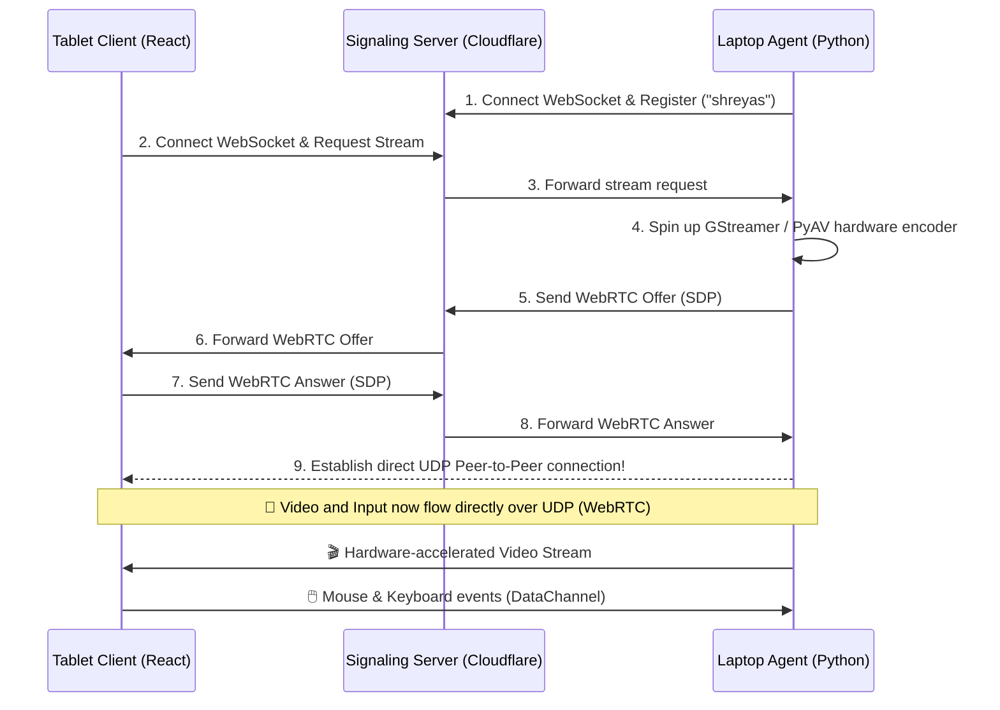

# 🏗️ Architecture

LapLink uses a modern, serverless WebRTC architecture designed for zero-maintenance and extreme reliability.

## 🧱 Core Components

### 1. 🖥️ Windows Agent (`agent/laplink_agent/main.py`)
- **Runtime:** Python (packaged into a headless `.exe` via PyInstaller).
- **Core Engine:** Uses `aiortc` for WebRTC stream initialization and lifecycle management.
- **Media Pipeline:** Leverages `PyAV` and `dxgiscreencap` / `d3d11scale` to hardware-capture the screen directly from the GPU and encode it seamlessly into H264 before passing it to WebRTC.
- **Input:** Captures control messages via `RTCDataChannel` and fires them natively to Windows APIs.

### 2. ☁️ Signaling Server (`worker/src/index.ts`)
- **Runtime:** Cloudflare Workers (TypeScript).
- **Role:** Pure WebSockets relay.
- **Details:** WebRTC requires a middleman to exchange SDP connection offers. This Cloudflare Worker keeps a WebSocket open for the Laptop and Tablet, acting as a mailbox to exchange WebRTC candidate data. Once connected, it gets out of the way!

### 3. 📱 Tablet Client (`web/src/App.tsx`)
- **Runtime:** React + Vite + TailwindCSS.
- **Role:** The control hub.
- **Details:** Automatically connects to the WebSocket, requests a stream from the Agent, and dynamically mounts a low-latency `<canvas>` or `<video>` feed of the Windows desktop. Dispatches UI interactions (touches/clicks) as JSON back over the WebRTC Data Channel.

---

## 📡 Data Flow

---

## 🌩️ Failure Modes & Resiliency

LapLink is designed to handle dropping network states gracefully:
- **Tablet Network Drop:** If the tablet hops from WiFi to Cellular, the WebRTC UDP stream breaks. The tablet automatically detects `iceConnectionState === 'failed'`, resets the UI, and requests a brand new stream seamlessly.
- **WebSocket Timeout:** Cloudflare forcefully kills idle WebSockets after 60s. The Laptop Agent sends a ping every `20s`, completely neutralizing this limitation.
- **Resolution Swapping:** If the stream drops frames due to terrible upload speed, the tablet can send a `{"type": "quality", "quality": "480p"}` message. The agent instantly restarts the WebRTC tracks with a smaller hardware scale factor without crashing the host app!
